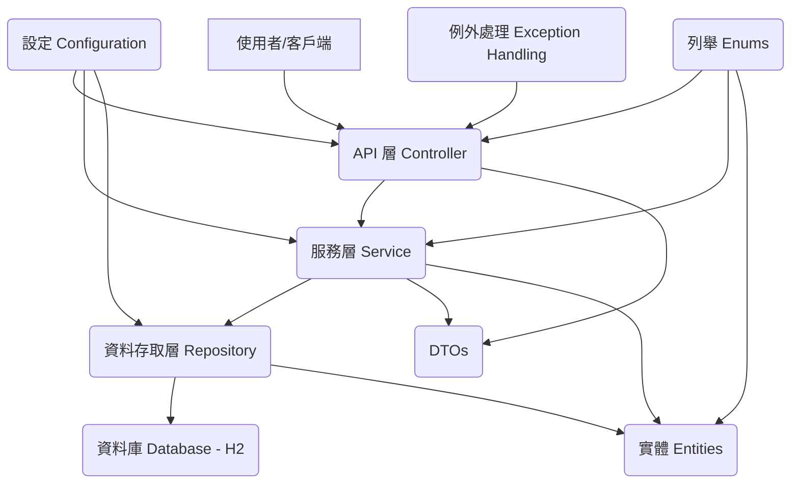

# 圖書館管理系統架構文件

## 1. 總覽

本文件旨在說明「圖書館管理系統」(`cbe-svc-library-manage`) 的系統架構。
此系統是一個基於 Java Spring Boot 的後端服務，提供圖書管理、借閱、歸還等核心功能。

### 1.1. 主要技術棧

- **核心框架**: Spring Boot 2.2.6.RELEASE
- **程式語言**: Java 11
- **Web 框架**: Spring Web MVC (用於建構 RESTful API)
- **資料存取**: Spring Data JPA
- **資料庫**: H2 Database (嵌入式記憶體資料庫，主要用於開發與測試)
- **API 文件**: Springfox Swagger 3.0.0
- **工具庫**:
    - Lombok: 簡化樣板程式碼 (Getter, Setter, Builder 等)
    - Jackson: JSON 資料處理
- **建置工具**: Apache Maven
- **日誌框架**: Logback

## 2. 系統架構

本系統採用典型的分層架構，將不同的職責分離到不同的層次，以提高模組化、可維護性和可測試性。

### 2.1. 各層職責

- **API 層 (Controller Layer)**: 負責接收外部 HTTP 請求，驗證輸入參數，調用服務層處理業務邏輯，並將處理結果封裝成標準化的回應格式返回給客戶端。使用 Spring MVC 實現。
- **服務層 (Service Layer)**: 包含核心的業務邏輯。它協調資料存取層和其他服務，執行具體的業務操作，如新增書籍、借閱、歸還等。此層也負責處理業務相關的例外情況。
- **資料存取層 (Repository Layer)**: 負責與資料庫進行互動，執行 CRUD (Create, Read, Update, Delete) 操作。使用 Spring Data JPA 簡化資料庫操作。
- **實體層 (Entity Layer)**: 定義了與資料庫表對應的 Java 物件 (POJO)，使用 JPA 註解進行映射。
- **DTOs (Data Transfer Objects)**: 用於在不同層之間傳遞資料，特別是在 API 層和服務層之間。請求 DTO 包含輸入驗證規則，回應 DTO 則封裝了操作結果。
- **設定 (Configuration)**: 包含應用程式的各種設定，如資料庫連接、Swagger API 文件設定、日誌設定等。
- **列舉 (Enums)**: 定義系統中使用的常數，如書籍狀態、語言、錯誤碼、回應碼等，提高程式碼的可讀性和可維護性。
- **例外處理 (Exception Handling)**: 集中處理系統中可能發生的例外，提供統一的錯誤回應格式。

## 3. 主要模組/元件

專案的主要 Java 程式碼位於 `cub.aco.svc.librarymanage` 套件下。

### 3.1. 設定 (Configuration)

- **`application.properties`**: 主要設定檔。
    - `spring.application.name=library-manage`: 應用程式名稱。
    - `spring.jpa.show-sql=true`: 顯示執行的 SQL。
    - `spring.jpa.hibernate.ddl-auto=create`: 應用程式啟動時自動建立資料庫表結構 (適用於 H2)。
    - `library.borrow.day=30`: 自訂屬性，書籍預設借閱天數。
- **`application-local.properties`**: 本地開發環境設定檔 (通常透過 Spring Profile 啟用)。
    - H2 資料庫連接資訊 (URL, Driver, Username, Password)。
    - `spring.h2.console.enabled=true`: 啟用 H2 Web 控制台。
- **`cub.aco.svc.librarymanage.config.SpringFoxConfig.java`**: 設定 Springfox Swagger，用於自動產生 API 文件。掃描所有 Controller 和路徑。
- **`logback.xml`**: 設定 Logback 日誌框架，定義日誌輸出的格式和級別。

### 3.2. API 層 (Controller Layer)

位於 `cub.aco.svc.librarymanage.controller` 套件下。

- **`BookController.java`**: 核心控制器，處理所有與書籍相關的 HTTP 請求。
    - 基礎路徑: `/book`
    - 主要端點 (皆為 POST 請求):
        - `/add`: 新增書籍 (請求: `AddBookRequest`)
        - `/modify`: 修改書籍 (請求: `UpdateBookRequest`)
        - `/delete`: 刪除書籍 (請求: `DeleteBookRequest`)
        - `/query`: 查詢書籍 (請求: `QueryBookRequest`, 回應: `QueryBookResponse`)
        - `/borrow`: 借閱書籍 (請求: `BorrowBookRequest`)
        - `/return`: 歸還書籍 (請求: `ReturnBookRequest`)
        - `/overdue`: 查詢逾期書籍 (請求: `QueryOverdueBookRequest`, 回應: `QueryOverdueBookResponse`)
    - 所有端點均返回標準化的 `ActionResponse`。
    - 注入 `BookService` 處理業務邏輯。
- **`ControllerExceptionHandler.java`**: 全域例外處理器。
    - 使用 `@ControllerAdvice` 攔截 Controller 拋出的例外。
    - 處理 `MethodArgumentNotValidException` (請求參數驗證失敗)。
    - 處理自訂的 `ErrorException`。
    - 處理其他 `RuntimeException`。
    - 返回包含 `returnCode` 和 `returnDesc` 的標準化 `ActionResponse`。

### 3.3. 服務層 (Service Layer)

位於 `cub.aco.svc.librarymanage.service` 套件下。

- **`BookService.java`**: 包含圖書管理的核心業務邏輯。
    - 注入 `BookRepository` 和 `BorrowLogRepository`。
    - 讀取 `library.borrow.day` 設定值。
    - **主要方法**:
        - `create(AddBookRequest)`: 新增書籍，檢查 ISBN 是否已存在。
        - `update(UpdateBookRequest)`: 更新書籍資訊，檢查書籍是否存在。
        - `delete(DeleteBookRequest)`: 刪除書籍，檢查書籍是否存在。
        - `query(QueryBookRequest)`: 根據不同條件 (ISBN, 書籍狀態, 書名模糊查詢) 查詢書籍。
        - `borrow(BorrowBookRequest)`: 處理借閱邏輯，更新書籍狀態，記錄借閱日誌。使用 `@Transactional`。
        - `returnBook(ReturnBookRequest)`: 處理歸還邏輯，更新書籍狀態，記錄歸還日誌。
        - `queryOverdueBooks(QueryOverdueBookRequest)`: 查詢逾期書籍。
    - 拋出 `ErrorException` 以表示業務錯誤 (例如 `ErrorCode.DATA_EXISTS`, `ErrorCode.BOOK_BORROWED`)。

### 3.4. 資料存取層 (Repository Layer)

位於 `cub.aco.svc.librarymanage.repository` 套件下。

- **`BookRepository.java`**: Spring Data JPA Repository 介面，用於操作 `Book` 實體。
    - 繼承 `JpaRepository<Book, String>` (主鍵為 ISBN)。
    - 自訂查詢方法:
        - `findByBookNameContaining(String bookName)`: 依書名模糊查詢。
        - `findByBookStatusAndBorrowDateBeforeOrderByBorrowDateAscBookBorrowerId(String bookStatus, LocalDate borrowDate)`: 查詢特定狀態且借閱日期早於指定日期的書籍，用於逾期查詢。
- **`BorrowLogRepository.java`**: Spring Data JPA Repository 介面，用於操作 `BorrowLog` 實體。
    - 繼承 `JpaRepository<BorrowLog, Integer>` (主鍵為自動產生的流水號)。
    - 使用預設的 CRUD 方法。

### 3.5. 實體層 (Entity Layer)

位於 `cub.aco.svc.librarymanage.entity` 套件下。

- **`Book.java`**: 對應資料庫中的 `BOOK_INFO` 表。
    - **主要欄位**: `bookIsbn` (PK), `bookLanguage`, `bookName`, `bookAuthor`, `bookPublisher`, `bookPubDate`, `bookCreateDate` (`@CreationTimestamp`), `bookStatus`, `bookBorrowerId`, `borrowDate`.
    - 使用 Lombok 註解 (`@Data`, `@Builder`, etc.) 和 JPA 註解 (`@Entity`, `@Table`, `@Id`, `@Column`).
- **`BorrowLog.java`**: 對應資料庫中的 `BORROW_LOG` 表。
    - **主要欄位**: `borrowSerialNo` (PK, `@GeneratedValue(strategy=GenerationType.IDENTITY)`), `borrowerId`, `borrowBookIsbn`, `borrowAction`, `actionDate` (`@CreationTimestamp`).
    - 使用 Lombok 和 JPA 註解。

### 3.6. 資料傳輸物件 (DTOs)

位於 `cub.aco.svc.librarymanage.dto` 套件下。

- **通用回應結構**:
    - `ActionResponse.java`: 包含 `mwHeader` (`ActionDetail` 型別)。
    - `ActionDetail.java`: 包含 `returnCode` 和 `returnDesc`。
- **請求 DTOs** (部分範例):
    - `AddBookRequest.java`: 包含新增書籍所需的欄位 (`bookIsbn`, `bookLanguage`, `bookName`, etc.) 及 JSR 303 Bean Validation 註解 (`@NotBlank`, `@Size`, `@Pattern`, `@NotNull`)。
    - `UpdateBookRequest.java`, `DeleteBookRequest.java`, `QueryBookRequest.java`, `BorrowBookRequest.java`, `ReturnBookRequest.java`, `QueryOverdueBookRequest.java`.
- **回應 DTOs** (部分範例):
    - `BookInfo.java`: 用於表示書籍的詳細資訊，通常在查詢結果中使用。
    - `QueryBookResponse.java`: 包含書籍列表 (`List<BookInfo>`) 和書籍數量。
    - `QueryOverdueBookResponse.java`: 包含逾期書籍列表和數量。

### 3.7. 列舉 (Enums)

位於 `cub.aco.svc.librarymanage.enums` 套件下。

- **`BookStatus.java`**: 書籍狀態 (IN:在庫, OUT:已借出, LOST:遺失)。使用 `@JsonValue` 和 `@JsonCreator` 進行 JSON 序列化/反序列化。
- **`Language.java`**: 書籍語言 (ZH:繁中, CH:簡中, EN:英文)。
- **`BorrowAction.java`**: 借閱操作類型 (例如 BORROW, RETURN - 根據 `BookService` 推斷)。
- **`ErrorCode.java`**: 業務錯誤碼 (例如 `DATA_EXISTS`, `DATA_NOT_FOUND`, `BOOK_BORROWED`)。
- **`QueryType.java`**: 查詢書籍的類型 (例如 ISBN, 書籍狀態, 書名 - 根據 `BookService` 推斷)。
- **`ResponseCode.java`**: API 回應碼 (例如 `SUCCESS`, `NOT_VALID`, `ERROR`, `SYSTEM_ERROR`)。
- **Convertors** (例如 `BookStatusConvertor.java`, `LanguageConvertor.java`): 可能是用於 Spring MVC 的參數綁定或特定轉換邏輯，但在此專案中，主要的 JSON 轉換由 Enum 自身的 `@JsonCreator` 和 `@JsonValue` 處理。

## 4. 資料庫設計

系統使用 H2 嵌入式資料庫。資料表結構根據 JPA Entity 自動產生 (`spring.jpa.hibernate.ddl-auto=create`)。

### 4.1. `BOOK_INFO` 資料表

對應 `Book.java` 實體。

| 欄位名稱         | 資料型態     | 約束/描述                     |
|------------------|--------------|-------------------------------|
| `book_ISBN`      | VARCHAR(30)  | Primary Key, 書籍 ISBN        |
| `book_language`  | VARCHAR(2)   | 書籍語言 (代碼)               |
| `book_name`      | VARCHAR(200) | 書名                          |
| `book_author`    | VARCHAR(200) | 作者                          |
| `book_publisher` | VARCHAR(200) | 出版社                        |
| `book_pub_date`  | DATE         | 出版日期                      |
| `book_create_date`| DATE        | 資料建立日期 (自動產生)       |
| `book_status`    | VARCHAR(2)   | 書籍狀態 (代碼)               |
| `book_borrower_ID`| VARCHAR(10)  | 借閱者 ID (若已借出)          |
| `borrow_date`    | DATE         | 借閱日期 (若已借出)           |

### 4.2. `BORROW_LOG` 資料表

對應 `BorrowLog.java` 實體。

| 欄位名稱           | 資料型態     | 約束/描述                     |
|--------------------|--------------|-------------------------------|
| `borrow_serial_no` | INTEGER      | Primary Key, 自動遞增         |
| `borrower_ID`      | VARCHAR(10)  | 借閱者 ID                     |
| `borrow_book_ISBN` | VARCHAR(30)  | 借閱書籍的 ISBN               |
| `borrow_action`    | VARCHAR(2)   | 操作類型 (借閱/歸還 代碼)     |
| `action_date`      | DATE         | 操作日期 (自動產生)           |

## 5. API 端點摘要

所有端點皆為 `POST` 請求，基礎路徑為 `/book`。

- `POST /book/add`: 新增書籍。
- `POST /book/modify`: 修改書籍資訊。
- `POST /book/delete`: 刪除書籍。
- `POST /book/query`: 查詢書籍。
- `POST /book/borrow`: 借閱書籍。
- `POST /book/return`: 歸還書籍。
- `POST /book/overdue`: 查詢逾期書籍。

## 6. 核心業務流程

### 6.1. 新增書籍
1. 客戶端發送 `POST /book/add` 請求，包含書籍資訊 (`AddBookRequest`)。
2. `BookController` 接收請求，驗證 DTO。
3. `BookController` 調用 `BookService.create()`。
4. `BookService` 檢查 ISBN 是否已存在，若存在則拋出 `ErrorException(ErrorCode.DATA_EXISTS)`。
5. 若 ISBN 不存在，則建立新的 `Book` 實體並保存到資料庫。
6. 返回成功的 `ActionResponse`。

### 6.2. 借閱書籍
1. 客戶端發送 `POST /book/borrow` 請求，包含書籍 ISBN 和借閱者 ID (`BorrowBookRequest`)。
2. `BookController` 接收請求，驗證 DTO。
3. `BookController` 調用 `BookService.borrow()`。
4. `BookService` (在 `@Transactional` 方法中):
    a. 查詢書籍是否存在，不存在則拋出 `ErrorException(ErrorCode.DATA_NOT_FOUND)`。
    b. 檢查書籍狀態：若為 `OUT` (已借出)，拋出 `ErrorException(ErrorCode.BOOK_BORROWED)`；若為 `LOST`，拋出 `ErrorException(ErrorCode.DATA_NOT_FOUND)`。
    c. 若書籍狀態為 `IN` (在庫)，則更新書籍狀態為 `OUT`，設定借閱者 ID 和借閱日期。
    d. 儲存更新後的 `Book` 實體。
    e. 建立 `BorrowLog` 實體，記錄借閱操作。
    f. 儲存 `BorrowLog` 實體。
5. 返回成功的 `ActionResponse`。

### 6.3. 歸還書籍
1. 客戶端發送 `POST /book/return` 請求，包含書籍 ISBN 和借閱者 ID (`ReturnBookRequest`)。
2. `BookController` 接收請求，驗證 DTO。
3. `BookController` 調用 `BookService.returnBook()`。
4. `BookService`:
    a. 查詢書籍是否存在，不存在則拋出 `ErrorException(ErrorCode.DATA_NOT_FOUND)`。
    b. 檢查書籍狀態：若為 `IN` (在庫)，拋出 `ErrorException(ErrorCode.BOOK_RETURNED)`；若為 `LOST`，拋出 `ErrorException(ErrorCode.DATA_NOT_FOUND)`。
    c. 若書籍狀態為 `OUT` (已借出)，則更新書籍狀態為 `IN`，清除借閱者 ID 和借閱日期。
    d. 儲存更新後的 `Book` 實體。
    e. 建立 `BorrowLog` 實體，記錄歸還操作。
    f. 儲存 `BorrowLog` 實體。
5. 返回成功的 `ActionResponse`。

### 6.4. 查詢逾期書籍
1. 客戶端發送 `POST /book/overdue` 請求，包含逾期天數 (`QueryOverdueBookRequest`)。
2. `BookController` 接收請求，驗證 DTO。
3. `BookController` 調用 `BookService.queryOverdueBooks()`。
4. `BookService`:
    a. 根據設定的 `library.borrow.day` 和請求的逾期天數，計算參考日期。
    b. 調用 `BookRepository.findByBookStatusAndBorrowDateBeforeOrderByBorrowDateAscBookBorrowerId()` 查詢狀態為 `OUT` 且借閱日期早於參考日期的書籍。
    c. 將查詢結果映射到 `List<BookInfo>`，並計算每本書的逾期天數。
5. `BookController` 將查詢結果封裝到 `QueryOverdueBookResponse` 並返回。

## 7. 總結

此圖書館管理系統是一個結構清晰、功能明確的 Spring Boot 應用程式。它採用了分層架構，並利用 Spring Boot 的特性簡化了開發和設定。系統提供了完整的書籍管理和借閱流程，並具備良好的擴展性基礎。
